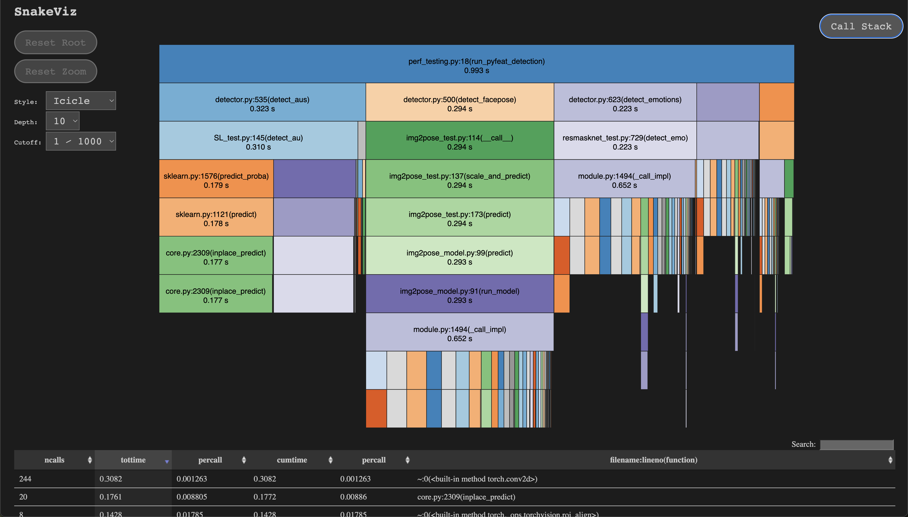

# Py-feat live

This is a standalone demo of using [py-feat](https://py-feat.org/) to analyze webcam frames in real time and display the results.

## Installation

1. Install: `pip install git+https://github.com/cosanlab/pyfeat-live.git`   
2. Run this command in the terminal to launch the GUI: `pyfeat-live`  

## Usage
1. Choose your camera by clicking on `SELECT DEVICE`.
2. Choose whether you would like to record the session by clicking `Record Session`. This will internally save the detections and frames as a video in memory. After you stop the session, there will be a button to download the Fex CSV file and also the corresponding video recording as an mp4.
3. Choose which detector models you would like to use with the `Swap detectors` buttons. This can be changed after the session is started.
4. Select which detectors you would like to run with the checkboxes. More detectors adds processing time and will slow the framerate. This can be changed on the fly.
5. Start the session by clicking the red `START` button.

## Development Details

Rather than use a more complicated installation process (see [the packaging branch](https://github.com/cosanlab/pyfeat-live/tree/packaging-backup)) to build platform independent executables, this is a simple CLI wrapper to launch a streamlit GUI using the `pyfeat-live` terminal command, similar to how `fsleyes` launches a GUI for `fsl`.

One thing to note is that if you only use a barebones py-feat install, the app will need to download all of the py-feat models. So the first time the app boots up it will take a minute or two to load. If you want to speed things up you can install `pyfeat-live` into the same environment as `py-feat` and the models will be preloaded.

## Setup

To run the barebones streamlit app for development, clone this repository then:

1. Create a new `conda` or `venv`
2. `pip install -r requirements.txt`
3. `streamlit run pyfeatlive/Detect.py`
4. Go to ` http://localhost:8501` in your browser

If you run into installation issues with py-feat see [this issue](https://github.com/cosanlab/py-feat/issues/186)

## Profiling

We also include a profiling script you can run with `python perf_testing.py`. This will generate a profiling file and save it as `basic.prof`

Then you can run `snakeviz basic.prof` to visualize what py-feat calls are taking taking the longest processing time on your system:

